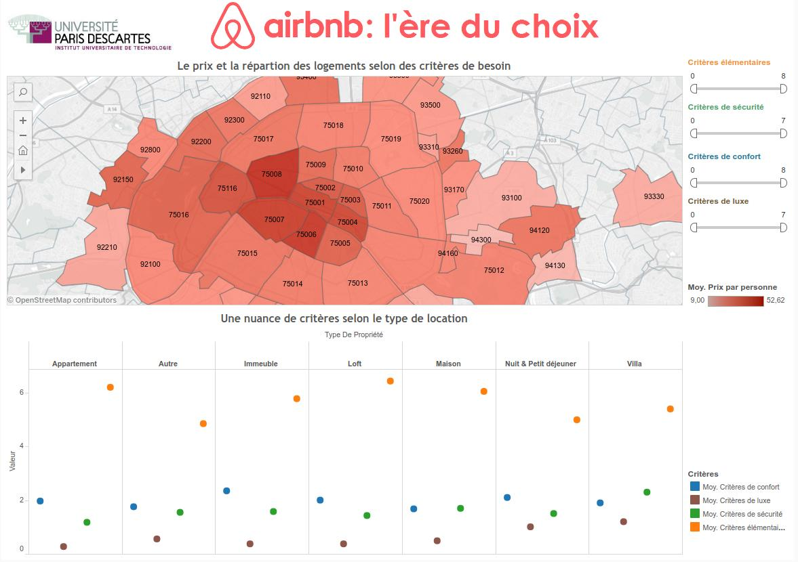

class: middle, center, inverse, title

# Concours dataviz

## Expérience au sein de la communauté STID

### François-Xavier Jollois

### CFIES2017 - Grenoble - septembre 2017

---

# Introduction

**Cadre** : DUT Statistique et Informatique Décisionnelle - *1ère année*

- Etudiants tout juste diplômés du baccalauréat
- Domaine du décisionnel et de la statistique
- Module dédié à la visualisation de données, avec en amont
	- Statistique descriptive
	- Programmation
	- Reporting
	- Manipulation de données
	- Communication
- 12 départements STID en France

**Deux éditions** à l'heure actuelle :

- Première expérience en 2016, à Paris puis Carcassonne
- Elargissement à presque tous les départements STID (10) en 2017

---

# Déroulement

Globalement identique pour les deux éditions :

- En amont, répartion des étudiants par groupe

- Données présentées aux étudiants

- Production d'une dataviz par groupe durant la journée
	- Outil libre (Excel, Power-point, Tableau, R, ...)
	- Libre choix de la problématique
	- Encadrement très léger

- Rendu et présentation devant un jury

---

# Objectifs et attendus

## Du point de vue *étudiants*

- Tester certaines compétences acquises par les étudiants

- Confronter les étudiants à des problématiques métiers

- Mettre en situation les étudiants autour d’un travail en équipe, dans un temps limité

Expérience nouvelle très bien perçue par les étudiants

---

# Objectifs et attendus

## Du point de vue *enseignants*

- Permettre un réel travail collaboratif à l’intérieur des départements

- Discuter avec les étudiants différemment

## Du point de vue *formation*

- Dialoguer entre les 12 départements STID de France

- Montrer aux entreprises les compétences de nos étudiants

- Montrer au grand public la vitalité de la formation

---

# Edition 2016

- **Données** : logements mis en location sur le site *AirBnB* le 2 septembre 2015, et mises à disposition par le site [*InsideAirBnB*](http://insideairbnb.com/)
	- Résumé du logement : quartier, géolocalisation, type et prix du logement
	- Détail du logement : type et nombre de lits, prix détaillés, présence ou non de divers appareils électroménagers ou autres équipements, acceptation ou non d'invités, idem pour les animaux, ...

- Aucune consigne donnée sur les problématiques

- Pour *Paris*, passage devant un large jury composé incluant des professionnels de deux entreprises
	- Lots communs
	- Participation à un séminaire organisé par une des entreprises

- Pour *Carcassonne*, travail obligatoire, suivi par une évaluation

---
# Résultats 2016

.left-column30[
- Visualisations vraiment intéressantes
- Choix de problématiques pertinents et assumés

[Lauréat 2016](cfies-concours-dataviz-1er2016.jpg)
]

.right-column70[

]

---

# Edition 2017

- **Partenariat** avec la SNCF, via le département *Innovation & Recherche*
	- Connées (présentées ci-dessous)
	- Coachs, provenant des équipes statistiques et/ou données, dans presque tous les départements

- **Données**: série des meilleurs temps de parcours d'environ 40 trajets Origine - Destination depuis 1920, enrichies des informations suivantes, pour chaque année et, le cas échéant, chaque origine et destination :
	- Population, taux de chômage, nombre d’emplois
	- Occupation des sols
	- Indices des prix de Paris
	- Fréquentations des principaux aéroports
	- Nombre d’immatriculations et livraison de carburant

---

# Edition 2017

- **Déroulement** : Date choisie le jeudi 18 mai 2017
	- Plus de 300 étudiants répartis sur toute la France, regroupés en équipes de 3 à 5
	- Présentation devant un jury propre à chaque site, composé d'enseignants et du coach SNCF présent

- **Processus de choix**
	- Choix pour chaque jury d'un travail pour la finale nationale
	- Deuxième notation par un jury national d'enseignants de chaque département pour sélectionner 3 production (venant de *Niort*, *Vannes* et *Paris*)
	- Dernière phase, effectuée par la SNCF, pour désigner le vainqueur : **Niort**

- **Consignes**
	- Problématique librement choisie par chaque groupe
	- Logiciel et forme de la restitution libres

---
# Résultats 2017

Data-visualisations de qualités inégales

- *Difficulté à choisir un angle de vue*
	- Etudiants décontenancés par les données
	- Problème pour dégager un sujet particulier à mettre en avant
	- Meilleures data-visualisation faites sur les données SNCF pures
	- Problématiques intéressantes relevées par représentants de la SNCF

- *Data-visualisation et statistiques descriptives*
	- Production parfois très (trop) classique
	- Manque de recherche sur la meilleure représentation
	- Data-visualisations primées au niveau national se distinguent justement par l'accent mis sur l'adéquation de la représentation graphique à la question posée.

- *Choix du logiciel* : qualité des documents produits avec Tableau globalement meilleure

---
# Résultats 2017

.left-column30[
[Lauréat 2017](cfies-concours-dataviz-1er2017.jpg)
]

.right-column70[

]

---

# Conclusion et futur

- Déception sur la qualité des travaux, liée à la compréhension du sujet et à l'établissement d'une problématique

- Confrontation à des problématiques métiers à améliorer

- Mise en situation des étudiants autour d’un travail en équipe réussie, sans problème intra-groupe

- Concertation inter-disciplines à approfondir

- Interaction de manière différente que dans le cadre d'un cours réussie

- Communication de la communauté STID autour de ce concours à revoir

- Travail en commun aux départements STID en France intéressant
