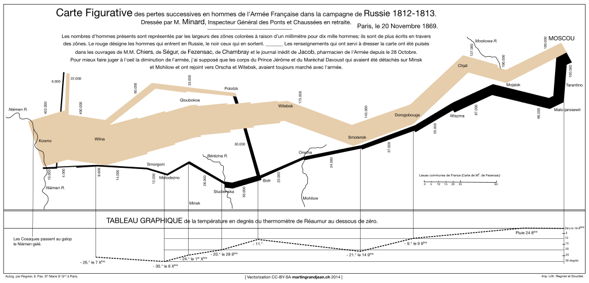
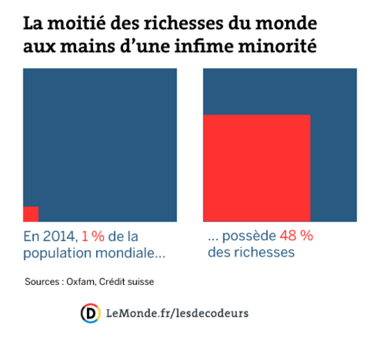
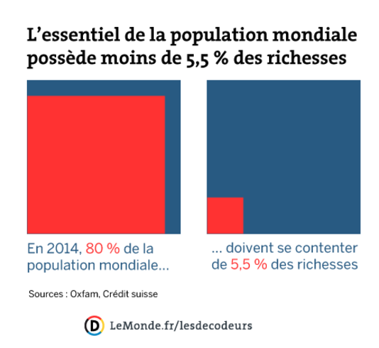
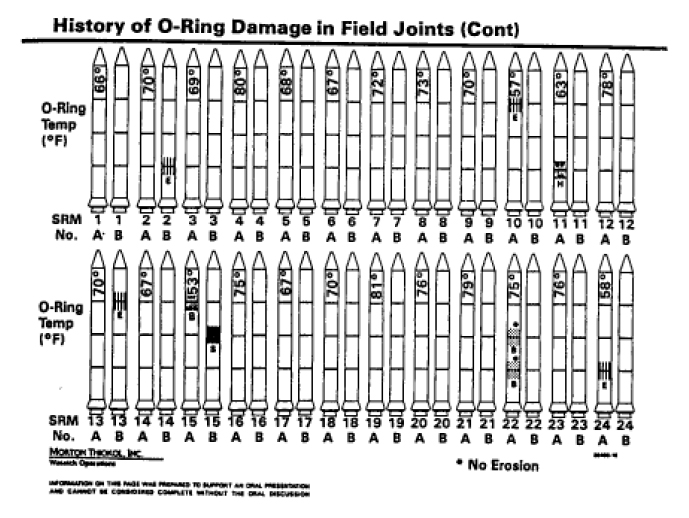
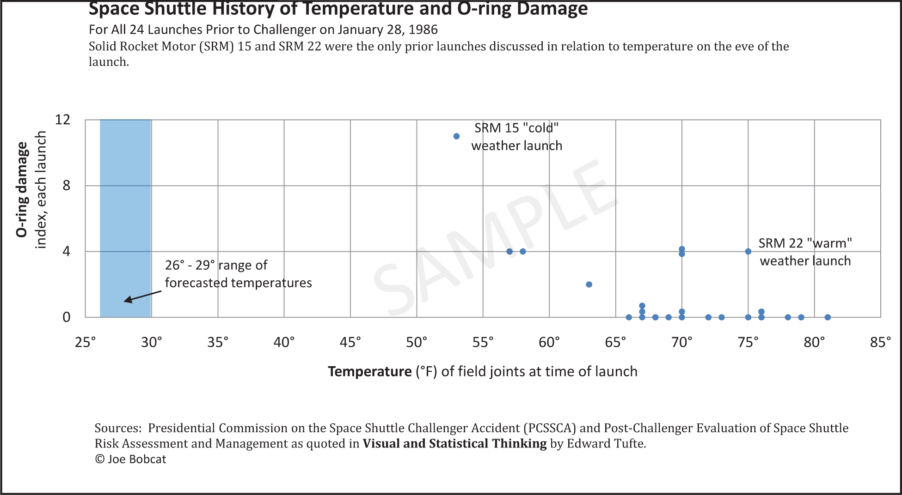
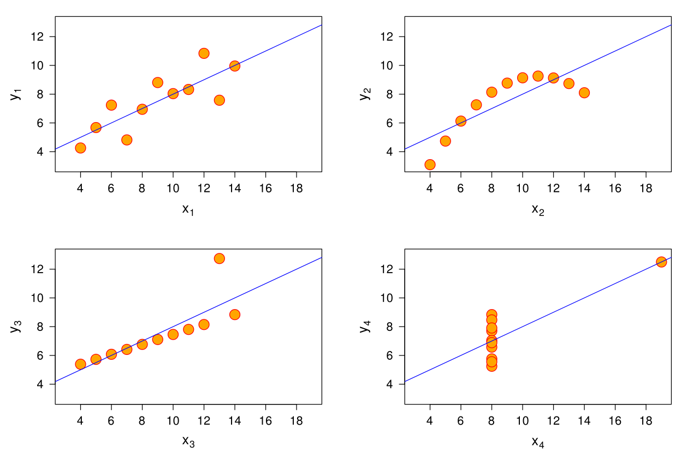

class: middle, center, inverse, title

# Un graphique vaut-il mieux qu'un long discours ?

François-Xavier Jollois

Séminaire INED - 05/12/2017

---

# Définition

Ensemble des méthodes et techniques permettant la représentation visuelle de données brutes, dans le but d’en faciliter l’analyse

Quelques contraintes :

- **Lisibilité** : le résultat doit être compréhensible directement
- **Pertinence** : la visualisation doit avoir du sens en terme métier
- **Validité** : les choix de représentation doivent être corrects statistiquement
- **Interactivité** : idéalement, l’utilisateur doit pouvoir naviguer dans le résultat pour mieux comprendre et analyser

---

# Quelques exemples de dataviz connues

Deux exemples classiques

- Balance commerciale du **Royaume-Uni**
- Campagne de Russie

Deux démonstration de l'intérêt d'un graphique

- Epidémie de choléra à Londres
- Navette challenger 

---
class: inverse, middle, center

# Un graphique vaut un long discours

---

.left-column30[
# Payfair - 1786

Représentation de la balance commerciale (importation vs exportation) du Royaume-Uni vers le Danemark et la Norvège 
]

.right-column70[  ]

---

# Minard - 1869

Effectifs de l’armée et température lors de la retraite de la campagne de Russie

---

# Partage des richesses

Article paru sur le blog Les Décodeurs sur LeMonde.fr ([article](http://www.lemonde.fr/les-decodeurs/article/2015/01/19/la-concentration-des-richesses-dans-le-monde-en-graphiques_4558914_4355770.html))

.left-column50[  ]

.right-column50[  ]

---
class: inverse, middle, center

# Un **bon** graphique vaut **mieux** qu'un long discours

---

# Epidémie de choléra à Londres - 1854

### Contexte

- Pas d'eau courante dans les logements
- Approvisionnements à des pompes dans la rue
- Théorie des **miasmes** (ou *mauvais air*) pour la transmission du choléra

--

### Problème : 

- 31 août 1854 : épidémie majeure de choléra dans le quartier Soho
    - Dans les trois jours suivants, 127 personnes meurent
    - Le 10 septembre, 500 personnes étaient mortes
    - Un total de 616 morts

---

# Epidémie de choléra à Londres - 1854

.left-column50[
Report de l'adresse de chaque personne décédée sur une carte

Identification d'une pompe spécifique sur *Broad Street*
]

.right-column50[  ]

---

.left-column30[
# Navette Challenger

Explosion de la navette Challenger de la NASA en 1986 (7 morts)

Ci-contre, graphique produit par la NASA

Graphique très peu lisible

Pas d’analyse réelle possible
]

.right-column70[  ]

---

.left-column30[
# Navette Challenger

Problème la veille du lancement : température **très faible** par rapport aux données connues

Quelle prévision ?
]

--

.right-column70[ 
 

Extrapolation possible, et choix sûrement différent sur le lancement

Tufte parle de **chartjunk** ou **bruit graphique**
]

---
class: middle, center, inverse

# Attention donc au **tout numérique** dans l'analyse

---

# Quartet d'Anscombe

.left-column30[
.small[4 séries statistiques de 11 points (x, y), ayant les mêmes valeurs pour les mesures suivantes :

- moyenne de X
- moyenne de Y
- variance de X
- variance de Y
- corrélation entre X et Y
- équation de la droite de régression
- somme des carrés des erreurs

Pas de distinction a priori entre les séries
]]

--

.right-column70[  ]

---
class: middle, center, inverse

# Pas de théorie mais du bon sens

---

# Principes selon E. Tufte 

.footnote[The Visual Display of Quantitative Information (1983)]

- Présenter les données
- Induire le lecteur à penser au contenu plutôt qu’au reste (méthodologie, design, …)
- Éviter les distorsions
- Présenter beaucoup de choses dans peu d’espace
- Rendre des grand jeux de données cohérents
- Encourager la comparaison des différentes données
- Révéler les données à plusieurs niveaux de détails (du plus large au plus fin)
- Servir un but précis et raisonnable (description, exploration, …)
- Être intégré avec une description textuelle et statistique des données

---
class: middle, center, inverse

# Deux exemples de dataviz **interactives**

---

# Gapminder

Hans Rosling, sur les données de revenu et d'espérance de vie depuis 1800

<https://www.gapminder.org/tools/>

- Visualisation 
    - d’une année
    - d’une animation déroulant l’évolution sur 200 ans
- Représentations possibles :   
    - Nuage de points
    - Carte géographiques
- Focus sur 
    - une zone géographique
    - un pays particulier

---

# France Pixels

Etienne Côme, sur les revenus fiscaux localisés des ménages en 2010

<http://www.comeetie.fr/galerie/francepixels/>

- Focus
    - à différentes échelles de zoom
- Visualisation
    - Densité de population
    - Répartition de catégories d'âges
    - Revenu moyen
    - ...

---
class: middle, inverse, citation

> The greatest value of a picture is when it forces us to notice what we never expected to see.

John Tukey
