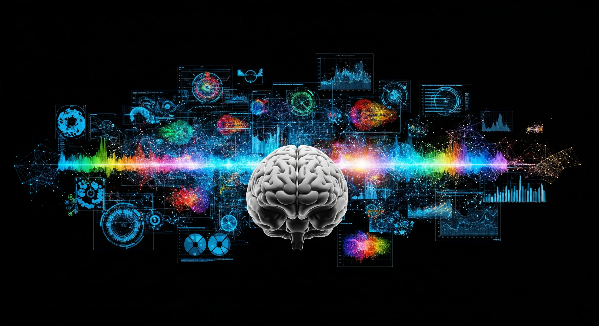

class: middle, center, inverse, title
# Science des Données

## ou Comment les données changent notre monde ?

---

## La Science des Données, c'est quoi ?

C'est l'art et la science d'**extraire** des **connaissances** et des informations utiles à partir de **quantités massives** de **données**.

--

---

## Nos vies remplies de données !

Les données sont partout et sont utiles pour mieux comprendre le monde.

--

* Votre **smartphone** : chaque clic, chaque recherche, chaque photo est une donnée

--

* Les **réseaux sociaux** : vos publications, likes, amis

--

* Les **jeux vidéo** : vos scores, vos habitudes de jeu

--

* Les services de **streaming** (Netflix, Spotify) : ce que vous regardez/écoutez

--

* Les **objets connectés** (montres intelligentes) : votre activité physique

---

## Quantité de données ou __*Big Data*__ 

Il n'y a pas sur la quantité que les choses évoluent

--

- **Volume** : le volume de données stockées à l’échelle mondiale double environ tous les quatre ans

--

- **Variété** : image, vidéo, audio, objets connectés...

--

- **Vélocité** : analyse des données en quasi temps réel sur des gros flux de données

--

- **Véracité** : erreurs, biais, manipulation...

--

- **Valeur** : intérêt des données sur les décisions à prendre

---
class: inverse

## Au croisement de plusieurs disciplines 

.footnote[.small[source : <https://commons.wikimedia.org/wiki/File:Data_Science.png>]]

---

## Le Super-Héros des Données !

--

Mélange d'un statisticien, d'un informaticien et d'un expert du domaine.

--

### Ses missions principales

* **Collecter ** : Rassembler les données.

--

* **Nettoyer ** : Préparer les données (elles sont souvent "sales" !).

--

* **Analyser ** : Chercher des tendances, des motifs.

--

* **Modéliser ** : Créer des outils pour prédire ou comprendre.

--

* **Visualiser ** : Rendre les données compréhensibles grâce à des graphiques.

--

* **Communiquer ** : Expliquer les découvertes.

---

## Comment ça marche, concrètement ?

.footnote[.small[source : <https://fr.linkedin.com/pulse/les-7-étapes-dun-projet-data-science-jérémy-bouzidi>]]

---

## Comment ça marche, concrètement ?

-  **Question ** : On commence toujours par une question ! 
    - "Quel film la plupart des élèves de seconde aiment-ils ?"

--

-  **Collecte des données ** : Récupérer les informations. 
    - Sondage auprès des élèves

--

-  **Nettoyage des données ** : Enlever les erreurs, les données manquantes. 
    - Si un élève a écrit "film" au lieu d'un titre de film

--

-  **Analyse et Modélisation ** : Trouver des schémas, construire un modèle. 
    - Utiliser des statistiques pour voir quel genre de film est le plus populaire

--

-  **Interprétation et Communication ** : Comprendre ce que disent les données et le présenter. 
    - "Les films de science-fiction sont très appréciés !"

---

## La Science des Données autour de nous !

--

* **Recommandations ** : Netflix, Spotify, Amazon (vous suggèrent ce que vous pourriez aimer).

--

* **Marketing ciblé ** : Les publicités que vous voyez sur internet.

--

* **Santé ** : Détection de maladies, aide au diagnostic, développement de médicaments.

--

* **Transports ** : Optimisation des itinéraires (Google Maps), voitures autonomes.

--

* **Météo ** : Prévisions plus précises.

--

* **Sport ** : Analyse des performances des athlètes.

--

* **Environnement ** : Suivi de la pollution, prévision des catastrophes naturelles.

---

## La Boîte à Outils du Scientifique des Données

--

* **Langages de programmation ** : Python et R sont les plus populaires (pas besoin de rentrer dans les détails, juste mentionner)

--

* **Logiciels de base de données ** : Pour stocker les données (SQL)

--

* **Outils de visualisation ** : Pour créer de beaux graphiques (Tableau, Power BI)

--

* **Excel ** : Un outil simple que beaucoup utilisent déjà

---

## Les Défis à relever

--

* **Qualité des données ** : Des données "sales" donnent de mauvais résultats
    - de simples erreurs ou malfonctions jusqu'à des problèmes de récupération (ex : salaire en France)

--

* **Confidentialité et Éthique ** : Comment utiliser les données sans nuire aux personnes ?
    - pas d'utilisation de la religion, l'origine éthnique, l'orientation sexuelle, ou autre

--

* **Biais ** : Les données peuvent refléter des inégalités ou des préjugés existants
    - apprentissage sur des européens pour un modèle appliqué sur des asiatiques par exemple

--

* **Comprendre les résultats ** : Il ne suffit pas d'avoir un chiffre, il faut l'expliquer
    - pour éventuellement connaître les leviers d'améliorations

---

## Pourquoi c'est important pour VOUS ?

--

* **Métiers d'avenir ** : C'est un domaine en pleine croissance avec de nombreuses opportunités.

--

* **Comprendre le monde ** : Mieux comprendre comment les décisions sont prises et comment les choses fonctionnent autour de vous.

--

* **Esprit critique ** : Développer la capacité à analyser l'information et à ne pas tout prendre pour argent comptant.

--

* **Compétences précieuses ** : Analyse, résolution de problèmes, programmation, communication.

---

## Les métiers dans la Science des Données

--

.left-column50[

* **Data Scientist**

* **Data Analyst**

* **Data Engineer**

* Architecte Big Data

* Développeur Data / IA

* Administrateur Big Data

* Data Protection Officier
]

--

.right-column50[
- En 2024, le secteur de la Data comptait pas moins de **80 000 professionnels** en France

- Salaire médian de 51 000€, et pouvant atteindre 99 000€ pour les profils seniors

- **Croissance des recrutements de 35%** en 2024
]
---

## Envie d'en savoir plus ?

--

* **Cours en ligne** : Plateformes permettant une introduction au domaine (Coursera, OpenClassrooms, Khan Academy) 

--

* **Projets personnels** : Analyser des données personnelles (scores de jeux, statistiques sportives)

--

* **Clubs de programmation / robotique** : Si votre lycée en a, foncez

--

* **Films / Documentaires**
    - *The Social Dilemma* pour les aspects éthiques
    - *Le Stratège* (histoire vraie) pour l'usage des statistiques dans le sport

--

* **Continuer ses études** : plusieurs filières existent
    - BUT Science des Données
    - Licence Informatique et/ou Mathématique
    - Ecole d'Ingénieur

---

## Des Questions ?

**Merci de votre attention !**

.footnote[.small[Sauf indication, les images ont été générées par l'IA Gemini]]

